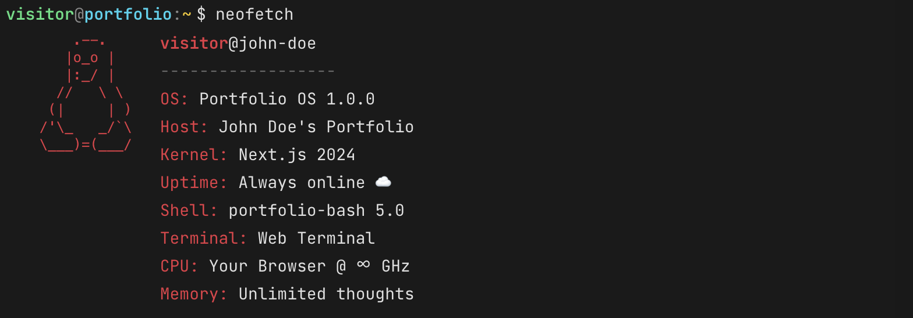
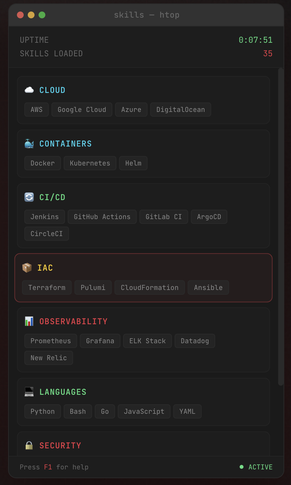

# Shell Portfolio

An interactive terminal-style portfolio website where visitors can explore your profile, skills, projects, and experience through a command-line interface.

## Screenshots


<details>
<summary>More Screenshots</summary>

### Terminal Commands


### Skills Widget


</details>

## Features

- **Personal Profile Header** — Displays your name, profile picture, title, and social links
- **Interactive Terminal** — Type commands or click the sidebar to navigate
- **Always-Visible Skills Widget** — An "htop-style" panel displaying your technical skills with live animations
- **Three-Panel Layout** — Commands sidebar, main terminal, and skills widget in a unified design
- **JSON-Based Data** — All content stored in separate JSON files for easy editing
- **Command History** — Use ↑/↓ arrow keys to browse previous commands
- **Tab Autocomplete** — Press Tab to autocomplete command names
- **Keyboard Shortcuts** — `Ctrl+C` to cancel, `Ctrl+L` to clear
- **Easter Eggs** — Try `neofetch`, `whoami`, `sudo`, or `rm -rf /`
- **Version Footer** — Displays current version with link to GitHub releases

## Layout

The portfolio features a personalized header with your profile and a three-column layout with consistent macOS-style window chrome:

| Section | Description |
|---------|-------------|
| **Header** | Profile picture, name, title, tagline, and social media links |
| **Commands Sidebar** | Quick-access buttons for all available commands |
| **Terminal** | Interactive command-line interface for exploring content |
| **Skills Widget** | Always-visible panel showing technical skills with cycling highlights |
| **Footer** | Version badge linking to releases and source code link |

## Available Commands

| Command | Description |
|---------|-------------|
| `help` | List all available commands |
| `about` | Learn about me |
| `skills` | View technical skills |
| `projects` | Browse featured projects |
| `experience` | View work history |
| `contact` | Get contact information |
| `clear` | Clear the terminal |

## Tech Stack

- [Next.js](https://nextjs.org) 16 with App Router
- [React](https://react.dev) 19
- [Tailwind CSS](https://tailwindcss.com) 4
- TypeScript

## Getting Started

1. Install dependencies:

```bash
npm install
```

2. Modify the template with your data
   - Replace `public/avatar.svg` with your own profile picture (supports `.svg`, `.png`, `.jpg`)
   - Update the templates in the `data` directory with your own information

3. Run the development server:

```bash
npm run dev
```

4. Open [http://localhost:3000](http://localhost:3000) to view the portfolio.

## Project Structure

```
├── app/
│   ├── page.tsx          # Main page with profile header & three-panel layout
│   ├── layout.tsx        # Root layout
│   └── globals.css       # Global styles & theme
├── components/
│   ├── Terminal.tsx      # Terminal emulator component
│   ├── Sidebar.tsx       # Command sidebar with window chrome
│   ├── SkillsWidget.tsx  # Always-visible skills panel
│   └── Footer.tsx        # Version and repository links
├── data/
│   ├── profile.json      # Personal info, links, and about content
│   ├── skills.json       # Technical skills data
│   ├── projects.json     # Featured projects data
│   └── experience.json   # Work experience data
├── docs/
│   └── screenshots/      # README screenshots
├── public/
│   └── avatar.svg        # Your profile picture (default placeholder included)
├── lib/
│   ├── commands.tsx      # Command definitions & rendering
│   ├── types.ts          # TypeScript interfaces for data
│   └── version.ts        # Version and repository configuration
└── .github/
    └── release.yml       # Auto-generated release notes configuration
```

## Customization

All portfolio content is stored in JSON files in the `data/` directory:

- **Profile** (`data/profile.json`): Your name, title, tagline, avatar path, email, social links, and about content
- **Skills** (`data/skills.json`): Edit skill categories, icons, and individual skills
- **Projects** (`data/projects.json`): Add or modify featured projects with descriptions and tech stacks
- **Experience** (`data/experience.json`): Update work history with positions, companies, and descriptions
- **Avatar** (`public/avatar.svg`): Replace with your own profile picture (update path in profile.json if using different format)
- **Styling** (`app/globals.css`): Customize colors, fonts, and theme
- **Version** (`lib/version.ts`): Update version number and repository URL

## Releases

This project uses GitHub's automatically generated release notes. PRs are categorized based on labels:
- `feature`, `enhancement` → 🚀 New Features
- `bug`, `fix`, `bugfix` → 🐛 Bug Fixes
- `ui`, `ux`, `design`, `styling` → 🎨 UI/UX Improvements
- `documentation`, `docs` → 📚 Documentation
- `chore`, `maintenance`, `refactor` → 🔧 Maintenance
- `dependencies` → 📦 Dependencies

## License

MIT
